# PISHANI.

**پیشانی** *(n.)*: Persian for "forehead".

Pishani is a Heads Up–style party game with desi and global decks. Put the phone on your forehead and your friends shout clues. Nod down if you got it, look up to pass.

It works **fully offline** as a PWA or an Android APK, fits every screen from 320px phones to tablets, and uses a "Montgomery brutalist" UI.

**[▶ Play in the browser](https://saqlainap.github.io/pishani/)** · **[⬇ Download the APK](https://github.com/SAQLAINAP/pishani/releases/latest/download/pishani.apk)**

<p>
  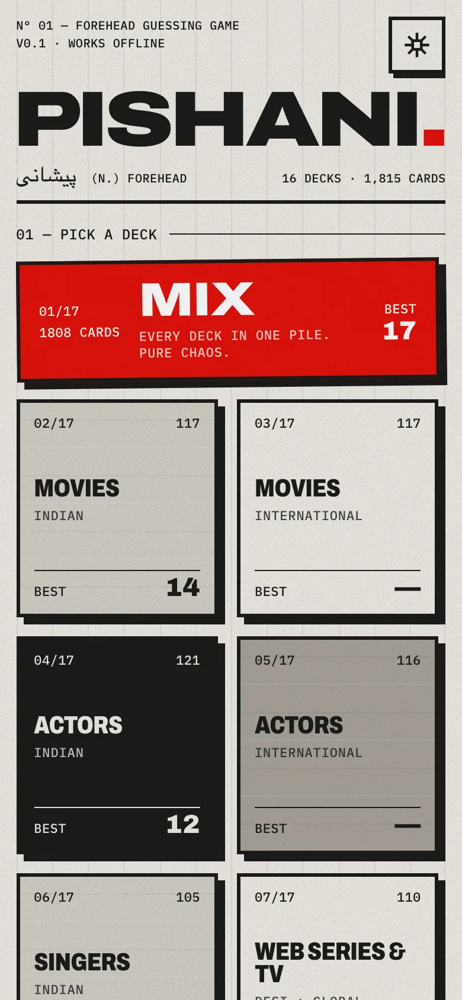
  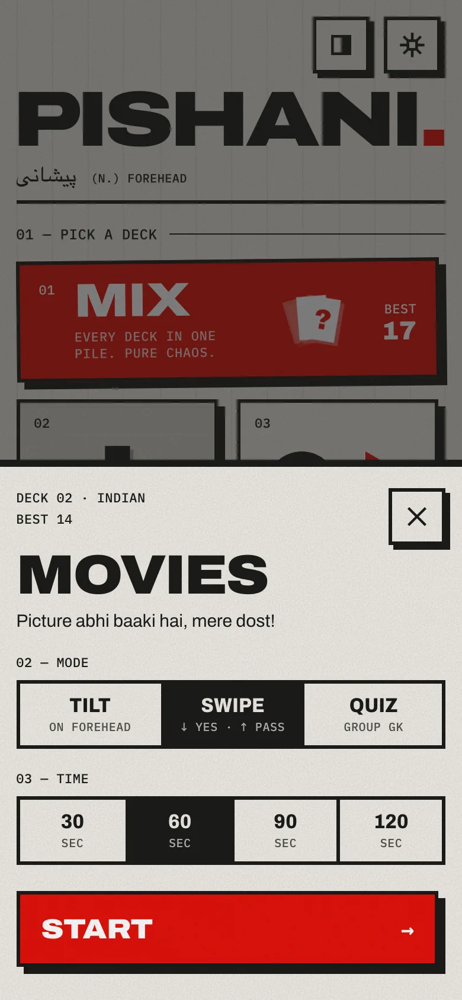
  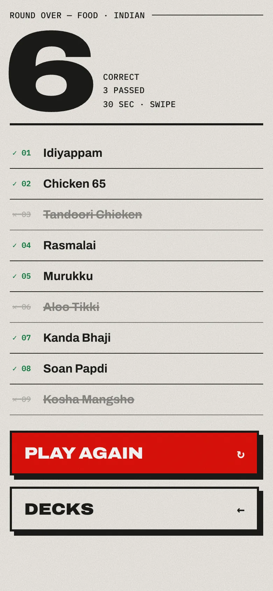
</p>

<p>
  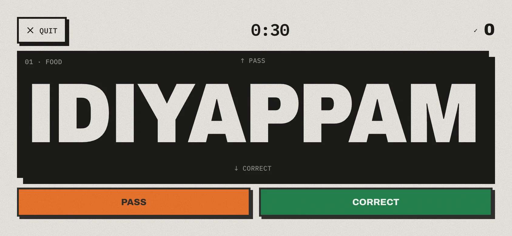
  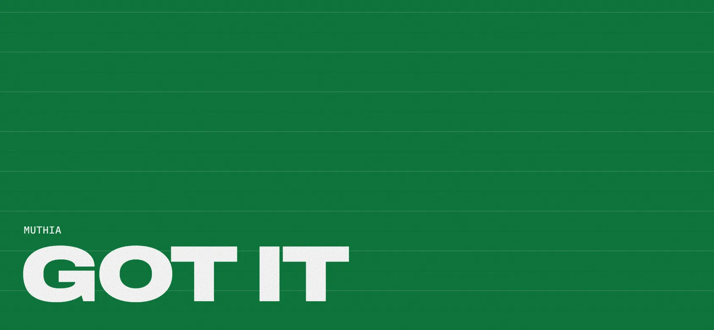
</p>

## How to play

1. Pick a deck, a mode and a round length (30, 60, 90 or 120 seconds).
2. One player puts the phone on their forehead with the screen facing out.
3. Everyone else describes, acts or hums the word. Just don't say it.
4. Get as many as you can before the buzzer.

| Mode | Correct | Pass |
|---|---|---|
| **Tilt** (classic) | Nod down: screen toward the floor | Look up: screen toward the ceiling |
| **Swipe** | Swipe down | Swipe up |

### Quiz mode: the autonomous quizmaster

Put the phone in the middle of the group.

1. A question appears, and a concrete column on the side drains to zero with a tick each second.
2. The last three seconds turn red and louder.
3. The buzzer goes, the answer is revealed, and the next question starts on its own a few seconds later.
4. Everyone locks their answer before the buzzer. The app doesn't keep score; the group does.

- **Two answer styles:** **A B C D** (four options, and the right one lights up green) or **Reveal** (the question alone, with the answer shown at zero).
- **Options:** 10 / 15 / 20 / 30 seconds per question, and 10 or 20 questions per quiz.
- **Controls:** Pause, or Android back, freezes the clock. **Show** and **Next** skip ahead when everyone has already locked in.
- **Afterwards:** an answer sheet lists every question with its answer.
- **Categories:** every deck except Actions has a quiz (you can't quiz a mime), with 180 questions each (3,720 quiz questions in total). A **Quizmaster only** section adds:
  - **General Knowledge**
  - **Taglines & Logos:** slogans, film dialogues, catchphrases, and simplified logo sketches drawn in-app. No trademarked artwork is bundled.
  - Four **BETA** categories: Tech & Software, Medic & Health, Finance & Econ, History & Geopolitics.

In tilt mode the countdown starts by itself once the phone is held upright on a forehead, or you can tap to start. If the device has no motion sensor (a desktop, say), the round falls back to swipe plus on-screen buttons. On a keyboard, ↓ or Space means correct and ↑ means pass.

## Decks

| | |
|---|---|
| Movies · Indian | Movies · International |
| Actors · Indian | Actors · International |
| Singers · Indian | Web Series & TV · Desi + Global |
| Food · Indian | Food · International |
| Brands · Indian | Brands · International |
| Cities · World | Countries · World |
| Landmarks · Famous Places | Sports Stars · Cricket + Global |
| Animals · Wild + Home | Actions · Act It Out |

Each deck has a couple of hundred cards, most popular first. Countries is the exception: it has every UN member state plus Vatican City.

**MIX** shuffles every deck into one pile. Each deck uses a shuffle bag, so you won't see a word again until you've gone through the whole deck, even across rounds.

## Design: Montgomery brutalism

The style mixes three things: raw civic-concrete architecture, the Swiss International Typographic Style, and a little anti-design.

- **Concrete.** Paper and concrete greys with an SVG grain for aggregate texture, and faint horizontal lines that imitate board-formed concrete. It's all generated in CSS, so there are no image assets.
- **Slabs.** Heavy blocks with 3px ink rules, **zero border radius**, and hard offset shadows with no blur. When you press a slab it drops into its own shadow.
- **Swiss.** An exposed 12-column hairline grid, flush-left grotesk type (Archivo, with a variable width axis), monospace metadata (IBM Plex Mono), and index numbers like `02/17`. **Swiss red** is the only accent colour.
- **Anti-design.** The MIX slab is knocked 0.6° off the grid, a hollow deck name falls off the ready screen, and a stamped "NEW BEST" appears on the results screen.
- **Deck art.** Every slab has a geometric pictogram drawn like a civic-building poster: an art-deco cinema, a thali from above, a skyline under a red sun. The pictograms are inline SVG in the slab's own colours, and cut-outs let the concrete show through.
- **Dark mode.** "Night concrete" uses dark slabs, pale rules and a grey cantilever shadow. Choose Auto, Light or Dark in settings, or use the toggle on the home screen. During a round the word always shows light on black.
- **Feedback.** The whole screen floods signal green for correct, safety orange for pass and red at the end of the round. Each one comes with a synthesised beep and, on Android, a vibration.

<p>
  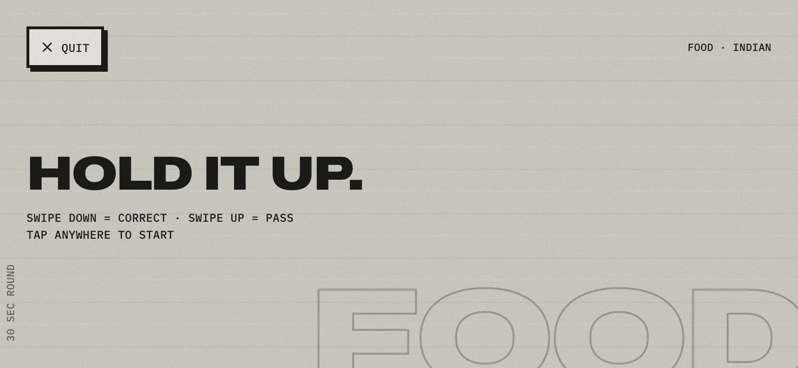
  
</p>
<p>
  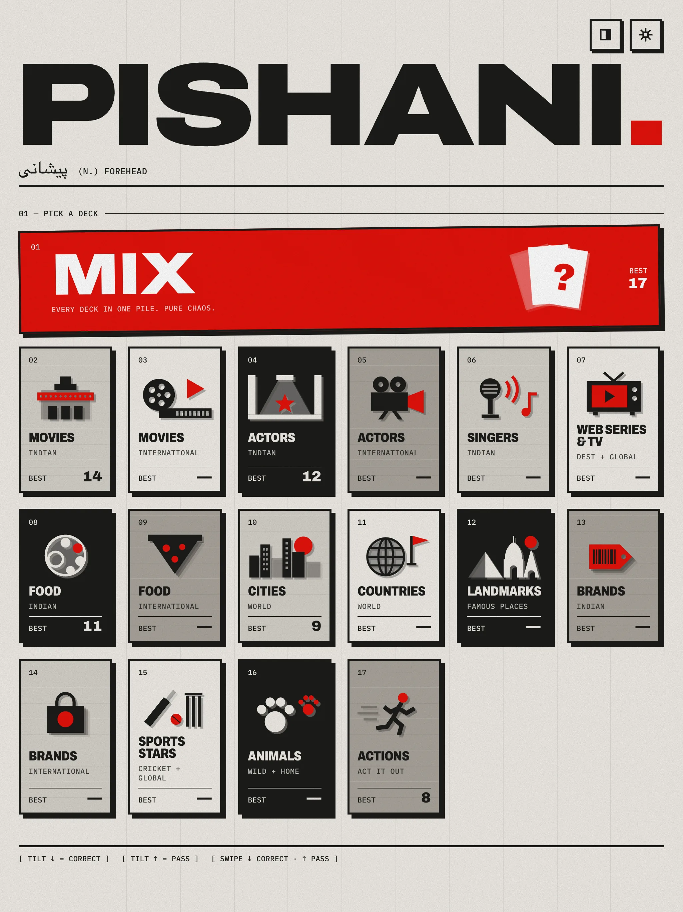
  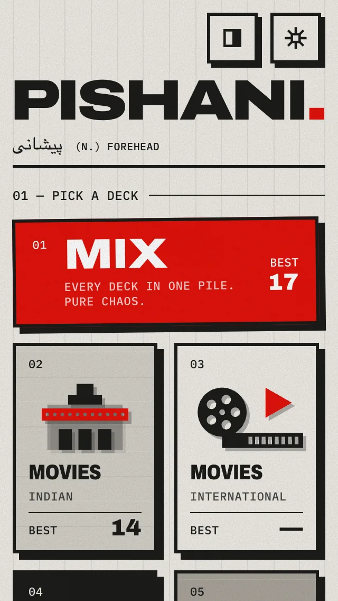
  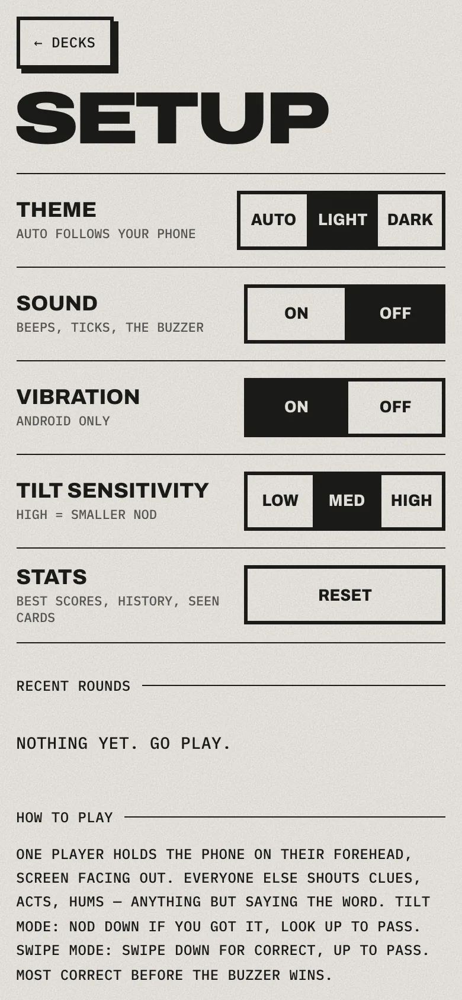
</p>
<p>
  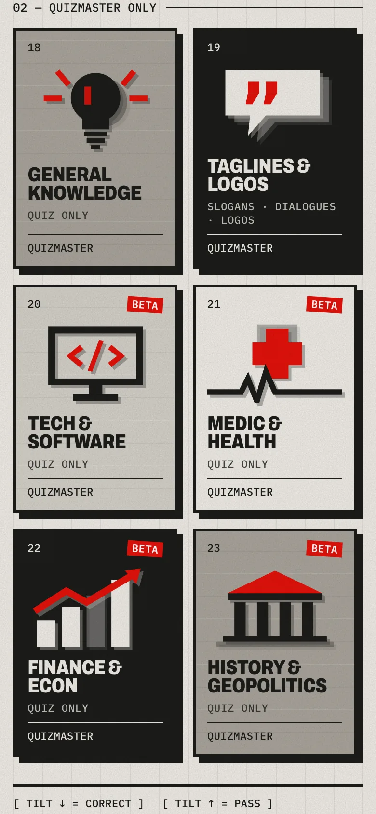
  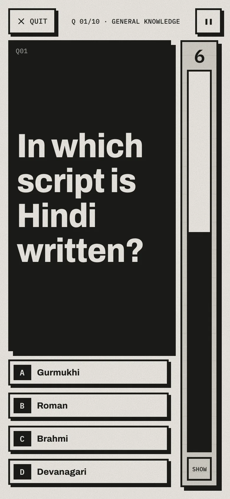
  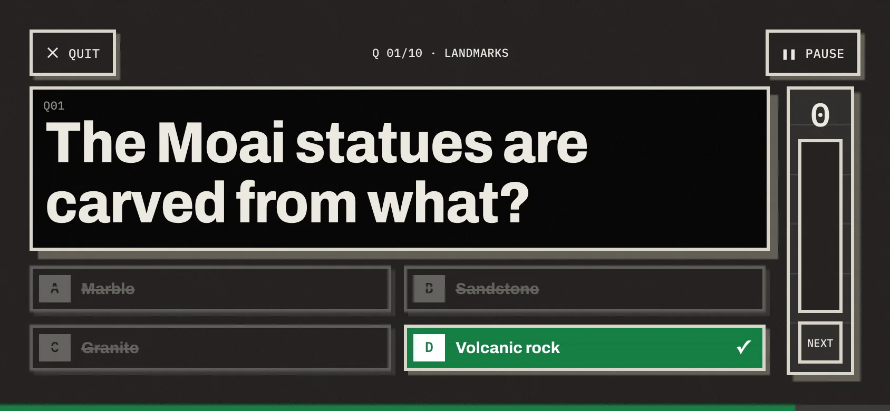
</p>
<p>
  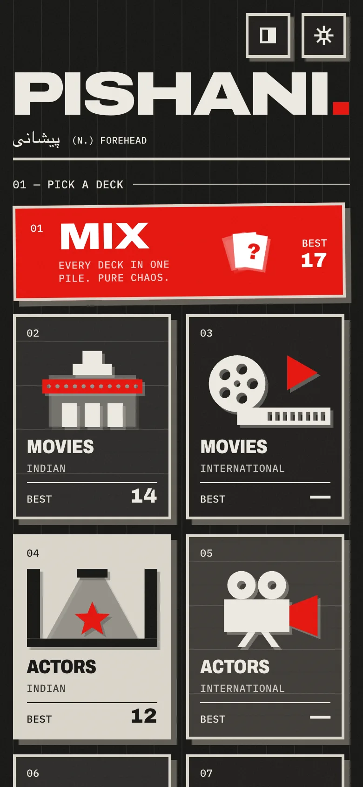
  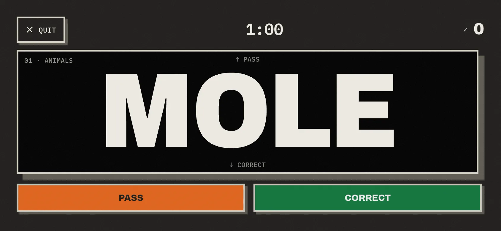
</p>

## How it works

| Part | Choice |
|---|---|
| App | React 19 + TypeScript + Vite. No router, because the app is a small state machine (`src/App.tsx`) |
| Offline | `vite-plugin-pwa` precaches the whole build, including fonts. There is no backend, so there's nothing that could fail offline |
| Android | Capacitor 8 wraps the same `dist/`, and `@capacitor/screen-orientation` locks landscape during a round |
| Tilt | `devicemotion` gravity z-axis → EMA smoothing → hysteresis state machine (`src/game/tilt.ts`) |
| Storage (v0) | State is kept in memory and mirrored to `localStorage` under one versioned name, `pishani:v0` (`src/store/storage.ts`) |
| Sound | Web Audio oscillators, with no audio files |
| CI | GitHub Actions builds the APK and deploys the PWA to Pages |

Why read gravity rather than device orientation angles? A phone standing upright on a forehead sits right where Euler angles hit gimbal lock. See [DECISIONS.md](DECISIONS.md) for the reasoning behind this and every other decision.

The app makes **no network requests**. There's no analytics, no accounts and no telemetry.

## Develop

```bash
npm ci
npm run dev           # http://localhost:5173
npm test              # tilt / swipe / shuffle / storage / deck-integrity tests
npm run build         # PWA in dist/
npm run icons         # regenerate PWA + Android icons and splash from public/favicon.svg
npm run android:apk   # local APK (needs the Android SDK). CI does this for you
```

Screenshots are regenerated with `npm install --no-save puppeteer-core`, then `npm run dev -- --port 5199`, then `npm run screenshots`.

### Getting the APK

- **Release:** every `v*` tag attaches `pishani.apk` to a [GitHub Release](https://github.com/SAQLAINAP/pishani/releases).
- **Per commit:** every push to `main` uploads a debug APK as an artifact of the *Android APK* workflow.

It's a debug-signed build, so Android will ask you to allow installs from this source.

## Project layout

```
src/
  App.tsx              view state machine: home → round → results
  screens/             Home, SetupSheet, Round (ready/countdown/play/time-up), Results, Settings
  game/                pure logic + tests: tilt, swipe, shuffle bag, round reducer
  store/               localStorage-mirrored store (+ tests)
  data/decks/          one file per deck
  lib/                 sound, haptics, wake lock, platform (orientation, motion permission)
  ui/                  FitText (largest font that fits without breaking a word), icons
  styles/app.css       the whole design system
android/               Capacitor project (committed; build outputs ignored)
scripts/               icon + screenshot generators
```

## License

MIT
